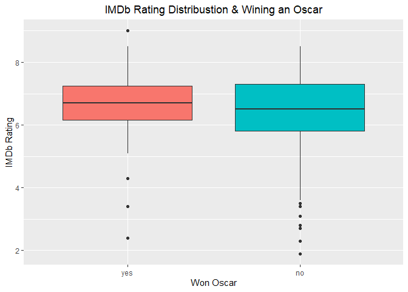
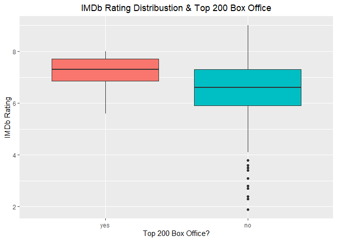
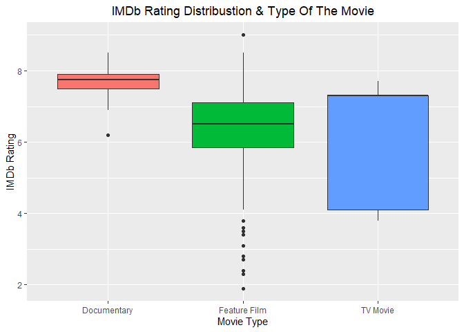
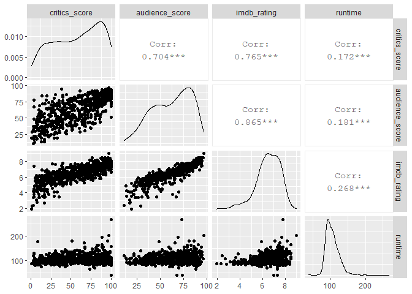
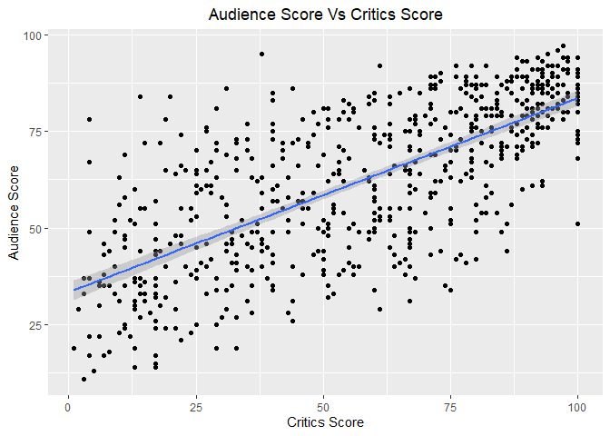
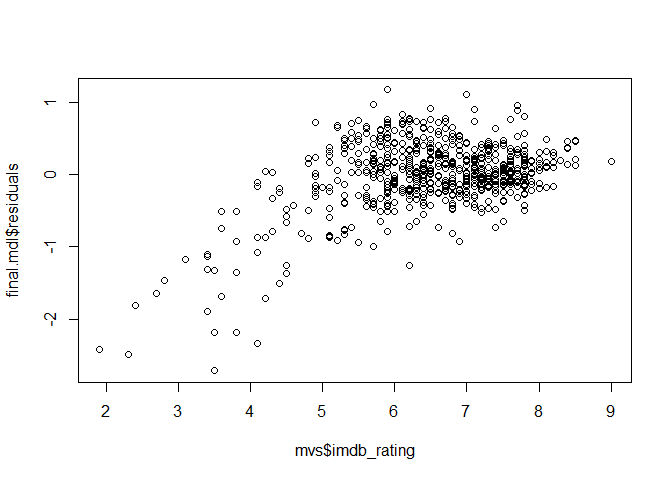
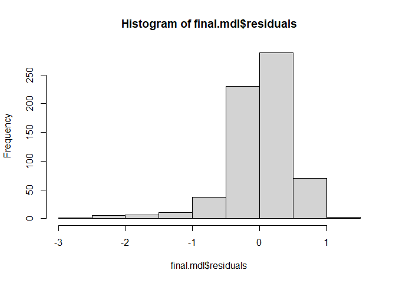
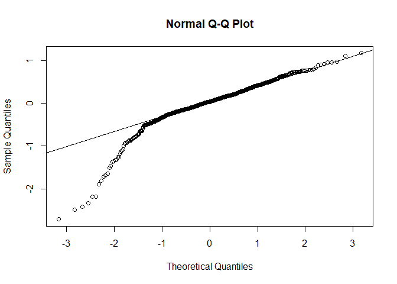
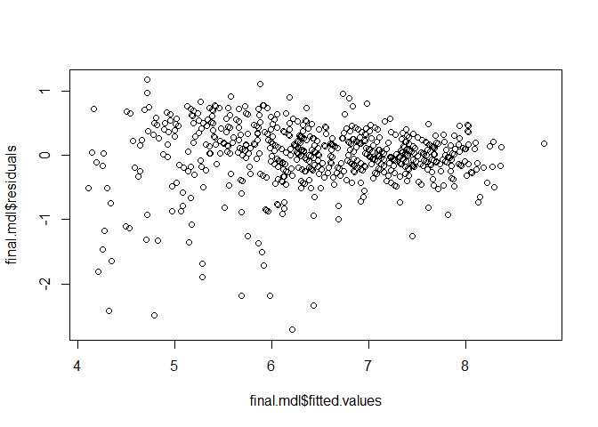
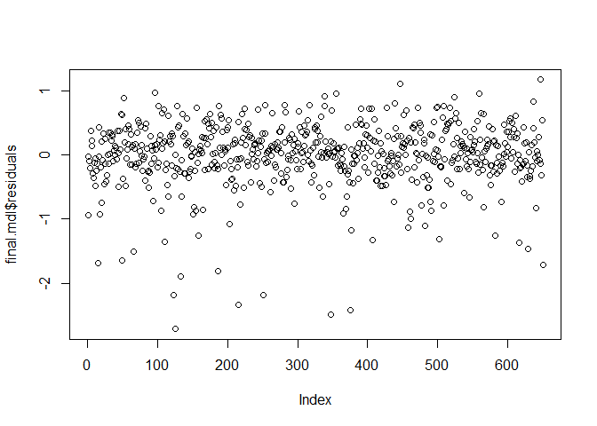

Predicting Movie Ratings
================

## Load packages

``` r
library(ggplot2)
library(dplyr)
library(statsr)
library(GGally)

load("movies.Rdata")
```

-----

## Research Questions

<blockquote>

<b>What are the best predictors for IMDb rating score?</b>

</blockquote>

In this project I want to explore the relation between Rotten Tomatoes
and IMDb rating systems. The question is of interest to me because
Rotten Tomatoes and IMDb are two of the most popular movie review
websites. However, the two platforms use different rating systems. I
would like to see how well a model built using movies data from Rotten
Tomatoes, would predict the rating score in IMDb rating system.<br />

<b>Variables used:</b>

<ul>

<li>

Rotten Tomatoes rating variables : critics\_score, critics\_rating,
audience\_score, and audience\_rating

</li>

<li>

IMDb rating variable: imdb\_rating

</li>

<li>

Movie information variables : runtime, best\_actress\_win,
best\_actor\_win, best\_dir\_win, best\_pic\_win, and top200\_box, and
title\_type

</li>

</ul>

**About the Data:**<br /> The data set is comprised of 651 randomly
sampled movies produced and released before 2016, collected from Rotten
Tomatoes and IMDb.

-----

## Exploratory Data Analysis

``` r
#select the variables
mvs <- movies %>%
  select(imdb_rating, critics_score,critics_rating, audience_score, audience_rating,
                runtime, best_actress_win, best_actor_win, best_dir_win, best_pic_win,
                top200_box, title_type) %>%
  filter(!is.na(runtime))

#create new variable won_oscar, did the movie won any type of Oscar?
mvs <- mvs %>%
  mutate(won_oscar = ifelse(best_actress_win == "yes" |
                              best_actor_win == "yes" |
                              best_pic_win == "yes" |
                              best_dir_win == "yes", "yes", "no" ))

mvs$won_oscar <- factor(mvs$won_oscar, levels = c("yes", "no"))
mvs$top200_box <- factor(mvs$top200_box, levels = c("yes", "no"))

#view data summary
summary(mvs)
```

    ##   imdb_rating    critics_score            critics_rating audience_score 
    ##  Min.   :1.900   Min.   :  1.00   Certified Fresh:135    Min.   :11.00  
    ##  1st Qu.:5.900   1st Qu.: 33.00   Fresh          :208    1st Qu.:46.00  
    ##  Median :6.600   Median : 61.00   Rotten         :307    Median :65.00  
    ##  Mean   :6.492   Mean   : 57.65                          Mean   :62.35  
    ##  3rd Qu.:7.300   3rd Qu.: 83.00                          3rd Qu.:80.00  
    ##  Max.   :9.000   Max.   :100.00                          Max.   :97.00  
    ##  audience_rating    runtime      best_actress_win best_actor_win best_dir_win
    ##  Spilled:275     Min.   : 39.0   no :578          no :557        no :607     
    ##  Upright:375     1st Qu.: 92.0   yes: 72          yes: 93        yes: 43     
    ##                  Median :103.0                                               
    ##                  Mean   :105.8                                               
    ##                  3rd Qu.:115.8                                               
    ##                  Max.   :267.0                                               
    ##  best_pic_win top200_box        title_type  won_oscar
    ##  no :643      yes: 15    Documentary : 54   yes:171  
    ##  yes:  7      no :635    Feature Film:591   no :479  
    ##                          TV Movie    :  5            
    ##                                                      
    ##                                                      
    ## 

``` r
ggplot( mvs, aes(x = won_oscar , y = imdb_rating, fill = won_oscar)) +
  geom_boxplot() +
  labs(title = "IMDb Rating Distribustion & Wining an Oscar",
       x = "Won Oscar",
       y = "IMDb Rating",
       fill = "Won Oscar?") +
    theme(plot.title = element_text(hjust = 0.5),
          legend.position = "none")
```

<!-- -->
<br />The above plot shows the distribution of IMDb ratings for movies
that won and did not win Oscar. Both the distributions are left skewed.
Oscar wining movies have less variation compared to non wining movies.

-----

``` r
ggplot( mvs, aes(x = top200_box, y = imdb_rating, fill = top200_box)) +
  geom_boxplot() +
    labs(title = "IMDb Rating Distribustion & Top 200 Box Office",
       x = "Top 200 Box Office?",
       y = "IMDb Rating") +
    theme(plot.title = element_text(hjust = 0.5),
          legend.position = "none")
```

<!-- -->
<br />It seems that movies that made it to the top 200 Box office have
higher median and nearly normal distribution of IMDb ratings. Meanwhile,
movies that did not make it to the top 200 have more spread of ratings.

-----

``` r
ggplot(mvs, aes( x = title_type, y = imdb_rating, fill = title_type)) +
  geom_boxplot() +
  labs(title = "IMDb Rating Distribustion & Type Of The Movie",
       x = "Movie Type",
       y = "IMDb Rating") +
    theme(plot.title = element_text(hjust = 0.5),
          legend.position = "none")
```

<!-- -->
<br />From the summary statistics done earlier, there are only 5
observations for TV movies. hence the shape of the distribution might
not be accurate. Documentary distribution has the highest ratings and
the least spread among other types of movies.

-----

``` r
ggpairs(mvs, columns = c("critics_score", "audience_score", "imdb_rating", "runtime"),  
        progress = FALSE)
```

<!-- -->

``` r
ggplot(mvs, aes(x = critics_score, y = audience_score)) +
  geom_point() +
  geom_smooth(method = "lm") + 
  labs(title = "Audience Score Vs Critics Score",
       x = "Critics Score",
       y = "Audience Score") +
    theme(plot.title = element_text(hjust = 0.5))
```

    ## `geom_smooth()` using formula 'y ~ x'

<!-- -->
<br />The above two plots shows strong correlation between audience
score and critics score. In order to avoid collinearity, only one of the
two variables will be used in the model. The choise will be based on
whichever gives higher R-Squared.

-----

## Modeling

Backward elimination method will be used to select the best model
(Parsimonious model). Since we are interested on prediction the
R-squared will be used as the selection criterion.

**Full Model**<br /> For the full model we consider all the variables
explored earlier, excluding critics score to avoid collinearity.
Moreover, the two variables audience\_rating and critics\_rating are
added to the model.

``` r
frmla <- as.formula(imdb_rating ~  audience_score + runtime  + title_type + 
                      won_oscar + critics_rating + audience_rating + top200_box)
full.mdl <- lm(frmla, data = mvs )
summary(full.mdl)
```

    ## 
    ## Call:
    ## lm(formula = frmla, data = mvs)
    ## 
    ## Residuals:
    ##      Min       1Q   Median       3Q      Max 
    ## -2.71909 -0.18752  0.04147  0.28859  1.17830 
    ## 
    ## Coefficients:
    ##                         Estimate Std. Error t value Pr(>|t|)    
    ## (Intercept)             3.596917   0.233534  15.402  < 2e-16 ***
    ## audience_score          0.047818   0.002098  22.793  < 2e-16 ***
    ## runtime                 0.006327   0.001102   5.743 1.44e-08 ***
    ## title_typeFeature Film -0.297373   0.076796  -3.872 0.000119 ***
    ## title_typeTV Movie     -0.428371   0.234120  -1.830 0.067759 .  
    ## won_oscarno            -0.079322   0.047402  -1.673 0.094742 .  
    ## critics_ratingFresh    -0.068084   0.056873  -1.197 0.231704    
    ## critics_ratingRotten   -0.377054   0.063351  -5.952 4.37e-09 ***
    ## audience_ratingUpright -0.425180   0.078700  -5.403 9.28e-08 ***
    ## top200_boxno            0.021510   0.132559   0.162 0.871147    
    ## ---
    ## Signif. codes:  0 '***' 0.001 '**' 0.01 '*' 0.05 '.' 0.1 ' ' 1
    ## 
    ## Residual standard error: 0.4956 on 640 degrees of freedom
    ## Multiple R-squared:  0.7942, Adjusted R-squared:  0.7913 
    ## F-statistic: 274.4 on 9 and 640 DF,  p-value: < 2.2e-16

**Model Selection**

After performing the backward elimination the following model is chosen
based on Adjusted R-squared value. The final model eliminated the
variable top200\_box.

``` r
#final model
frmla <- as.formula(imdb_rating ~  audience_score + runtime  + title_type + 
                      won_oscar + critics_rating + audience_rating)
final.mdl <- lm(frmla, data = mvs )
summary(final.mdl)
```

    ## 
    ## Call:
    ## lm(formula = frmla, data = mvs)
    ## 
    ## Residuals:
    ##      Min       1Q   Median       3Q      Max 
    ## -2.71894 -0.18747  0.04048  0.28851  1.17835 
    ## 
    ## Coefficients:
    ##                         Estimate Std. Error t value Pr(>|t|)    
    ## (Intercept)             3.619590   0.186975  19.359  < 2e-16 ***
    ## audience_score          0.047818   0.002096  22.810  < 2e-16 ***
    ## runtime                 0.006310   0.001096   5.759 1.31e-08 ***
    ## title_typeFeature Film -0.298054   0.076623  -3.890 0.000111 ***
    ## title_typeTV Movie     -0.428820   0.233926  -1.833 0.067244 .  
    ## won_oscarno            -0.079379   0.047365  -1.676 0.094246 .  
    ## critics_ratingFresh    -0.066842   0.056313  -1.187 0.235678    
    ## critics_ratingRotten   -0.375838   0.062858  -5.979 3.73e-09 ***
    ## audience_ratingUpright -0.425374   0.078631  -5.410 8.92e-08 ***
    ## ---
    ## Signif. codes:  0 '***' 0.001 '**' 0.01 '*' 0.05 '.' 0.1 ' ' 1
    ## 
    ## Residual standard error: 0.4952 on 641 degrees of freedom
    ## Multiple R-squared:  0.7942, Adjusted R-squared:  0.7916 
    ## F-statistic: 309.2 on 8 and 641 DF,  p-value: < 2.2e-16

**Interpretation of model coefficients**<br /> Audience\_score Slope:
all else held constant, for each 1% increase in audience score the model
predicts the IMDb rating to be higher on average by 0.048 rating score.

<ol>

<li>

Title type Slope:

</li>

<ul>

<li>

All else held constant, the model predict that feature films ratings are
on average 0.298 rating score lower than documentary movies.

</li>

<li>

All else held constant, the model predict that TV movies ratings are on
average 0.429 rating score lower than documentary movies.

</li>

</ul>

<li>

Won Oscar slope:

</li>

<ul>

<li>

All else held constant, the model predict that non Oscar wining movies
ratings are on average 0.079 rating score lower than documentary movies.

</li>

</ul>

<li>

Critics rating Slope:

</li>

<ul>

<li>

All else held constant, the model predict that movies rated Fresh by
critics are on average 0.067 rating score lower than Certified Fresh
rated movies.

</li>

<li>

All else held constant, the model predict that movies rated Rotten by
critics are on average 0.376 rating score lower than Certified Fresh
rated movies.

</li>

</ul>

<li>

Audience rating Slope:

</li>

<ul>

<li>

All else held constant, the model predict that movies rated Upright by
Audience are on average 0.425 rating score lower than Certified Fresh
rated movies.

</li>

</ul>

</ol>

**Model diagnostics**<br /> Here we examine the conditions of multiple
linear regression.

<ol>

<li>

<b>Linear Relationship between audience score and IMDb rating</b>

</li>

``` r
#check for linearity 
plot(final.mdl$residuals ~ mvs$imdb_rating)
```

<!-- -->
<br />We notice that the lower tail have more negative residuals. Since
the residuals are not randomly scattered around zero. This condition has
not been met.

<li>

<b>Nearly normal residuals with mean 0</b>

</li>

``` r
hist(final.mdl$residuals)
```

<!-- -->

``` r
#plot probability plot of residuals
qqnorm(final.mdl$residuals)
qqline(final.mdl$residuals)
```

<!-- -->
<br />The distribution of residuals is centered around zero. However,
there is a left skew in the distribution. Moreover, the probability plot
shows huge deviation from the mean at the tail area. Hence, this
condition is weakly satisfied.

<li>

<b>Constant Variability of residuals</b>

</li>

``` r
plot(final.mdl$residuals ~ final.mdl$fitted.values)
```

<!-- -->
<br />The variability of the residuals decreases as the fitted values
increases. Hence this condition is not satisfied.

<li>

<b>Independent residuals</b>

</li>

</ol>

``` r
plot(final.mdl$residuals)
```

<!-- -->
<br />It seems there is no time-series pattern. Hence, this conditions
is met.

-----

## Prediction

Now we will see how does the model predict the IMDb rating for the movie
“Arrival”

``` r
#create the movie data frame, IMDb rating : 7.9
film <- data.frame(runtime = 116,
           title_type = "Feature Film",
           won_oscar = "no",
           audience_score = 82,
           critics_rating = "Certified Fresh",
           audience_rating = "Upright")

predict(final.mdl, film)
```

    ##        1 
    ## 7.469787

<br />The model predicts an IMDb rating score of 7.5 for the provided
movie information.

-----

<b>Prediction Interval</b>

``` r
#construct a prediction interval
predict(final.mdl, film, interval = "prediction", level = 0.95)
```

    ##        fit     lwr      upr
    ## 1 7.469787 6.49277 8.446804

<br /><b>interpretation:</b><br /> the model predicts, with 95%
confidence, that a Feature movie with a Rotten Tomatoes audience score
of 82, critics rating of “Certified Fresh”, audience rating of
“Upright”, and no Oscar award is expected to have an IMDb rating
score between 6.5 and 8.4.

<br /><b>Reference for the movie data:</b><br />
<https://www.rottentomatoes.com/m/arrival_2016><br />
<https://www.imdb.com/title/tt2543164/>

-----

## Conclusion

Although the predicted value for the given movie was far from the true
value. The model did not satisfy most of the condition. the model showed
high inconsistency of residuals.This is probably due to the nature of
relationship between the response variable and the explanatory numerical
variable audience score.Although the two variables are highly
correlated, it seems their relationship might not be linear.<br />
Moreover, many of the used variables in the model are highly related to
each other, for example, the audience rating is actually based the
audience score. Therefore, the model might be overfitted.

<b>Ideas for future research:</b> Using a larger sample in the future
would reveal the true nature of the relationship between the variables.
Moreover, it might help the model to satisfy some of the conditions.
